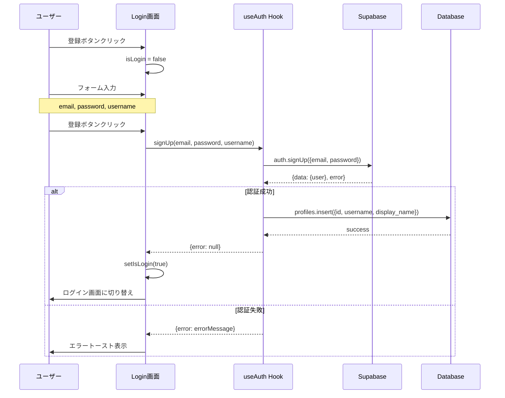

# ユーザーアカウント作成機能仕様書

## 概要

NicheHubにおけるユーザーアカウント作成機能の詳細仕様をまとめる。この機能は専門分野ごとのクローズドコミュニティSNSへの新規ユーザー登録を実現する。

## 機能概要

### 主要機能
- 新規ユーザーアカウント作成
- メールアドレス認証
- ユーザープロフィール初期設定
- コミュニティ初期選択

## UI/UX仕様

### 画面構成

#### ログイン・登録画面 (`src/pages/Login.tsx`)
- **左側パネル**: NicheHubの紹介とコミュニティ紹介
  - アプリケーション名とキャッチフレーズ
  - 3つの主要コミュニティ（Business、Art、Technology）の説明
- **右側フォーム**: ログイン・登録切り替え式フォーム

#### 入力フィールド

##### 共通フィールド
- **メールアドレス**: `email` (必須)
  - タイプ: `email`
  - プレースホルダー: "your-email@example.com"
  - バリデーション: メール形式

##### 登録時のみ必要なフィールド
- **パスワード**: `password` (必須)
  - タイプ: `password`
  - プレースホルダー: "8文字以上のパスワード"
  - 最小長: 8文字

- **パスワード確認**: `confirm-password` (必須)
  - タイプ: `password`
  - プレースホルダー: "パスワードを再入力"
  - バリデーション: パスワードと一致

- **ユーザー名**: `username` (必須)
  - タイプ: `text`
  - プレースホルダー: "username123"
  - 用途: 一意のユーザーID

### 状態管理

#### フォーム状態
```typescript
const [email, setEmail] = useState('');
const [password, setPassword] = useState('');
const [username, setUsername] = useState('');
const [isLogin, setIsLogin] = useState(true);
const [isLoading, setIsLoading] = useState(false);
```

#### モード切り替え
- `isLogin`: ログインモード（true）/ 登録モード（false）
- 動的フォーム表示制御

## バックエンド仕様

### 認証システム (`src/hooks/use-auth.tsx`)

#### signUp関数
```typescript
const signUp = async (email: string, password: string, username: string) => {
  // Supabase Auth を使用したユーザー登録
  const { data, error } = await supabase.auth.signUp({
    email,
    password,
  });
  
  // プロフィール作成
  if (data.user && !error) {
    await supabase.from('profiles').insert({
      id: data.user.id,
      username,
      display_name: username,
    });
  }
}
```

### データベース構造

#### profilesテーブル
```sql
profiles {
  id: string (Primary Key, UUID)
  username: string (必須, 一意)
  display_name: string | null
  avatar_url: string | null
  bio: string | null
  created_at: string (自動生成)
  updated_at: string (自動生成)
}
```

#### 制約・ルール
- `id`: Supabase Authのuser.idと連携
- `username`: 一意制約、ユーザー識別子として使用
- `display_name`: 初期値はusernameと同値
- `avatar_url`: 初期値null（後から設定可能）

## プロセスフロー

### 1. アカウント作成フロー



### 2. バリデーション

#### フロントエンド検証
- **必須フィールドチェック**: すべてのフィールドが入力済み
- **メール形式チェック**: HTML5バリデーション
- **パスワード長チェック**: 8文字以上
- **ユーザー名存在チェック**: 空文字でないこと

#### バックエンド検証
- **メール重複チェック**: Supabase Authによる自動処理
- **ユーザー名重複チェック**: データベース制約による処理
- **パスワード強度**: Supabaseの設定に依存

### 3. エラーハンドリング

#### エラーケース一覧
```typescript
// よくあるエラーパターン
errors = {
  "User already registered": "このメールアドレスは既に登録済みです",
  "Invalid email": "正しいメールアドレスを入力してください",
  "Password too short": "パスワードは8文字以上で入力してください",
  "Username already exists": "このユーザー名は既に使用されています"
}
```

#### エラー表示
- **Toast通知**: `use-toast`フックを使用
- **エラータイトル**: "登録エラー"
- **エラー詳細**: `error.message`を表示
- **バリアント**: "destructive"（赤色表示）

## 登録後の処理

### 1. メール認証
- Supabaseの設定に基づく確認メール送信
- メール内リンククリックで認証完了

### 2. コミュニティ選択 (`src/pages/CommunitySelection.tsx`)
- 登録完了後の初期コミュニティ選択
- 複数コミュニティ選択可能
- 後から変更可能

### 3. ダッシュボード遷移
- コミュニティ選択完了後
- `/dashboard`へリダイレクト

## セキュリティ考慮事項

### 認証・認可
- **パスワードハッシュ化**: Supabase Authによる自動処理
- **セッション管理**: JWT tokenによる管理
- **CSRF対策**: Supabaseライブラリによる自動対応

### データ保護
- **個人情報暗号化**: Supabaseの暗号化機能使用
- **SQL injection対策**: ORMによる自動エスケープ
- **XSS対策**: Reactの自動エスケープ機能

## 制限事項・注意点

### 技術的制限
- **ユーザー名変更**: 現在未実装（将来対応予定）
- **パスワードリセット**: 別機能として実装済み
- **SNS認証**: 現在未対応

### ビジネス制限
- **年齢制限**: 現在未設定
- **利用規約同意**: UI未実装（法的要件を確認要）
- **プライバシーポリシー**: UI未実装

## 今後の改善予定

### 機能追加
- [ ] SNS認証（Google、Twitter等）
- [ ] ユーザー名重複チェックのリアルタイム検証
- [ ] パスワード強度インジケーター
- [ ] 利用規約・プライバシーポリシー同意チェック

### UX改善
- [ ] 登録完了アニメーション
- [ ] プログレスバー表示
- [ ] フォーム自動保存機能
- [ ] より詳細なエラーメッセージ

### セキュリティ強化
- [ ] 2要素認証対応
- [ ] パスワード履歴管理
- [ ] 不正アクセス検知
- [ ] レート制限強化

## 実装ファイル一覧

### フロントエンド
- `src/pages/Login.tsx` - メインのログイン・登録画面
- `src/hooks/use-auth.tsx` - 認証関連のカスタムフック
- `src/pages/CommunitySelection.tsx` - 初期コミュニティ選択画面
- `src/components/ui/button.tsx` - ボタンコンポーネント
- `src/hooks/use-toast.ts` - トースト通知システム

### バックエンド・設定
- `src/integrations/supabase/client.ts` - Supabaseクライアント設定
- `src/integrations/supabase/types.ts` - データベース型定義
- Database Schema: profiles, communities, user_communities テーブル

### スタイリング
- `src/index.css` - グローバルスタイル（Tailwind CSS）
- UI Componentsライブラリ（shadcn/ui）

## 依存関係

### 主要ライブラリ
- **React** (v18+): UIフレームワーク
- **Supabase**: BaaS（認証・データベース）
- **React Router**: ルーティング
- **Tailwind CSS**: スタイリング
- **shadcn/ui**: UIコンポーネントライブラリ
- **React Hook Form**: フォーム管理（将来導入予定）

### 開発ツール
- **TypeScript**: 型安全性
- **Vite**: ビルドツール
- **ESLint**: コード品質管理</code_edit>
</edit_file>

✅ `docs/signup.md` にユーザーアカウント作成機能の詳細仕様書をマークダウン形式で作成しました。

## 📋 作成された内容

### 🎯 **主要セクション**
1. **概要** - NicheHubのアカウント作成機能の目的
2. **機能概要** - 新規登録、認証、プロフィール設定等の主要機能
3. **UI/UX仕様** - Login.tsxの画面構成と入力フィールド詳細
4. **バックエンド仕様** - Supabase認証システムとデータベース構造
5. **プロセスフロー** - アカウント作成の詳細フロー（Mermaid図付き）
6. **セキュリティ考慮事項** - 認証・認可、データ保護対策
7. **制限事項・注意点** - 現在の制限と今後の改善予定
8. **実装ファイル一覧** - 関連するすべてのファイルパス
9. **依存関係** - 使用ライブラリとツール

### 🔧 **技術詳細**
- TypeScriptコードサンプル
- データベーススキーマ定義
- エラーハンドリング戦略
- バリデーションルール
- セキュリティ対策

この仕様書は、`src/`ディレクトリのコードベース分析に基づいて作成されており、開発チームが参照・拡張・保守を行うための完全なリファレンスとなります。